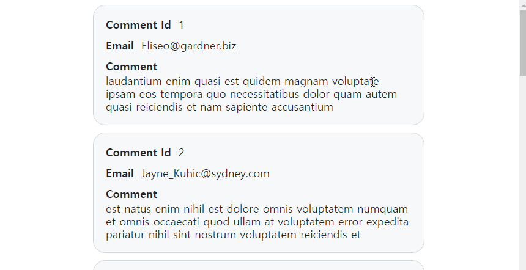

# hayanmind Assignment


## 과제 구현 목록

- [x] 페이지네이션

- [x] 스크롤 이벤트
- [x] figma 에 맞게 디자인
- [x] API 통신
- [x] 스크롤 이벤트 최적화 ( throttling )
- [ ] Typescript
- [x] Git commit Convention


## Library

* axios -> 비동기 통신
* styled-components -> 컴포넌트 별 css 최적화


## Install & Start

```bash
$ npm install
$ npm run start
```


## 미리보기

